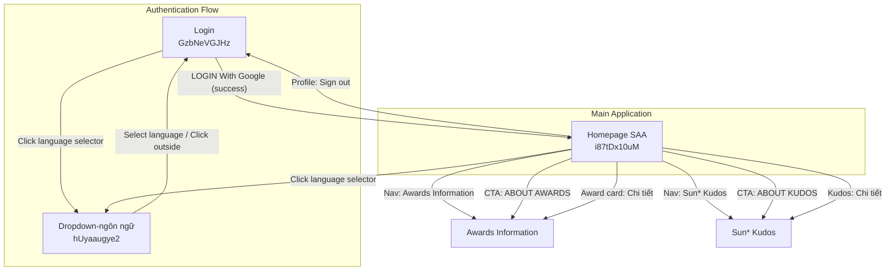
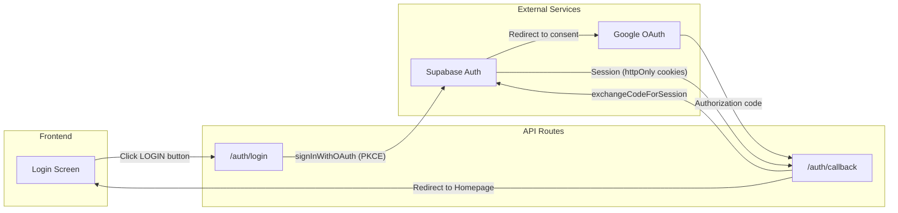

# Screen Flow Overview

## Project Info
- **Project Name**: SAA 2025 (Sun Annual Awards)
- **Figma File Key**: 9ypp4enmFmdK3YAFJLIu6C
- **Figma URL**: https://www.figma.com/design/9ypp4enmFmdK3YAFJLIu6C
- **Created**: 2026-04-06
- **Last Updated**: 2026-04-06

---

## Discovery Progress

| Metric | Count |
|--------|-------|
| Total Screens | 7 |
| Discovered | 7 |
| Remaining | 0 |
| Completion | 100% |

---

## Screens

| # | Screen Name | Screen ID | Figma Link | Status | Detail File | Predicted APIs | Navigations To |
|---|-------------|-----------|------------|--------|-------------|----------------|----------------|
| 1 | Login | GzbNeVGJHz | [Figma](https://momorph.ai/files/9ypp4enmFmdK3YAFJLIu6C/frames/GzbNeVGJHz) | discovered | [spec.md](specs/GzbNeVGJHz-Login/spec.md) | GET /auth/login, GET /auth/callback | Homepage SAA (i87tDx10uM), Dropdown-ngôn ngữ (hUyaaugye2) |
| 2 | Homepage SAA | i87tDx10uM | [Figma](https://momorph.ai/files/9ypp4enmFmdK3YAFJLIu6C/frames/i87tDx10uM) | discovered | [spec.md](specs/i87tDx10uM-HomepageSAA/spec.md) | GET /api/notifications, PATCH /api/notifications/read, GET /api/user/profile, POST /auth/signout | Awards Information, Sun* Kudos, Dropdown-profile (721:5223), Dropdown-ngôn ngữ (hUyaaugye2) |
| 3 | Countdown - Prelaunch | 8PJQswPZmU | [Figma](https://momorph.ai/files/9ypp4enmFmdK3YAFJLIu6C/frames/8PJQswPZmU) | discovered | [spec.md](specs/8PJQswPZmU-CountdownPrelaunch/spec.md) | None | None (standalone holding page) |
| 4 | Hệ thống giải (Awards System) | zFYDgyj_pD | [Figma](https://momorph.ai/files/9ypp4enmFmdK3YAFJLIu6C/frames/zFYDgyj_pD) | discovered | [spec.md](specs/zFYDgyj_pD-HeThongGiai/spec.md) | None (static content) | Sun* Kudos, Homepage (via header nav) |
| 5 | Dropdown Ngôn Ngữ (Language) | hUyaaugye2 | [Figma](https://momorph.ai/files/9ypp4enmFmdK3YAFJLIu6C/frames/hUyaaugye2) | discovered | [spec.md](specs/hUyaaugye2-DropdownNgonNgu/spec.md) | None | None (overlay component, closes in-place) |
| 6 | Sun* Kudos - Live Board | MaZUn5xHXZ | [Figma](https://momorph.ai/files/9ypp4enmFmdK3YAFJLIu6C/frames/MaZUn5xHXZ) | discovered | [spec.md](specs/MaZUn5xHXZ-SunKudosLiveBoard/spec.md) | GET/POST /api/kudos, GET /api/kudos/highlights, GET /api/kudos/stats, POST /api/kudos/:id/like, POST /api/secret-box/open, GET /api/sunner-leaderboard | Homepage (via header nav), Awards Information (via header nav) |
| 7 | Viết Kudo (Write Kudo Dialog) | ihQ26W78P2 | [Figma](https://momorph.ai/files/9ypp4enmFmdK3YAFJLIu6C/frames/ihQ26W78P2) | discovered | [spec.md](specs/ihQ26W78P2-VietKudo/spec.md) | POST /api/kudos, POST /api/kudos/upload-image, GET /api/users/search | None (modal dialog, closes in-place) |

---

## Navigation Graph

---

## Screen Groups

### Group: Authentication
| Screen | Purpose | Entry Points |
|--------|---------|--------------|
| Login | Google OAuth login, app entry point | App launch (unauthenticated), middleware redirect from protected routes |

### Group: Main Application
| Screen | Purpose | Entry Points |
|--------|---------|--------------|
| Homepage SAA | Main hub after login — countdown, awards grid, kudos promo | Successful Google OAuth login, nav link "About SAA 2025", logo click |

---

## API Endpoints Summary

| Endpoint | Method | Screens Using | Purpose |
|----------|--------|---------------|---------|
| /auth/login | GET | Login | Initiate Supabase Google OAuth (PKCE flow) |
| /auth/callback | GET | Login | Handle Google OAuth redirect, exchange code for session |
| /api/notifications | GET | Homepage SAA | Fetch unread notification count and list |
| /api/notifications/read | PATCH | Homepage SAA | Mark notifications as read |
| /api/user/profile | GET | Homepage SAA | Fetch user profile data (name, avatar, role) |
| /auth/signout | POST | Homepage SAA | Destroy session and redirect to Login |

---

## Data Flow

---

## Technical Notes

### Authentication Flow
- Google OAuth via Supabase Auth (PKCE flow)
- Session stored in httpOnly cookies via `@supabase/ssr`
- No JWT exposed to client-side JavaScript

### State Management
- Server state: Supabase session via cookies (managed by middleware)
- Local state: Button loading state (React useState in client component)

### Routing
- Router: Next.js App Router
- Protected routes enforced via `src/middleware.ts` using `src/libs/supabase/middleware.ts`
- Unauthenticated users → redirect to Login
- Authenticated users on Login → redirect to Homepage

---

## Discovery Log

| Date | Action | Screens | Notes |
|------|--------|---------|-------|
| 2026-04-06 | Initial discovery | Login | First screen spec created for auth flow |
| 2026-04-06 | Spec created | Homepage SAA | Full spec + design-style generated from Figma |

---

## Next Steps

- [x] Discover and spec Homepage SAA (screen i87tDx10uM)
- [ ] Discover and spec Language Dropdown (screen hUyaaugye2)
- [ ] Map remaining screens from Figma file
- [ ] Complete navigation paths for all discovered screens
