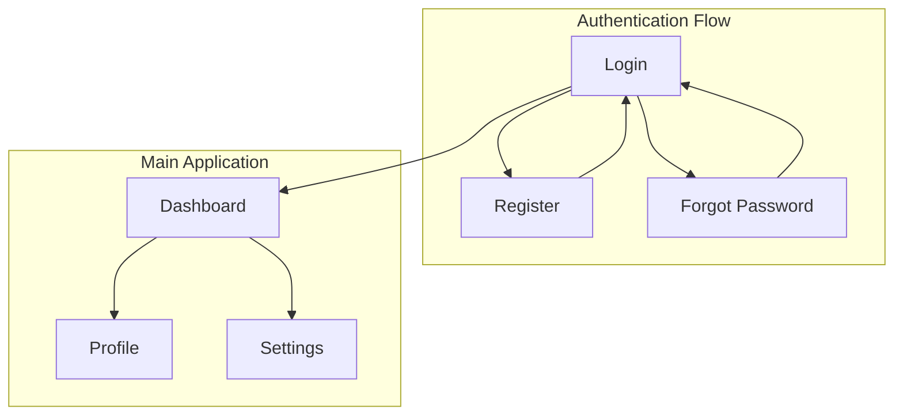
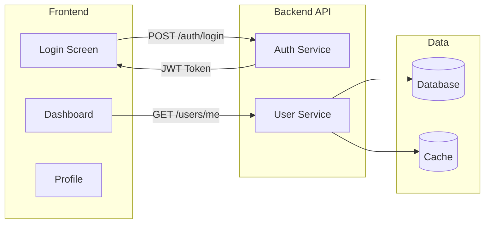

# Screen Flow Overview

## Project Info
- **Project Name**: [PROJECT_NAME]
- **Figma File Key**: [FIGMA_FILE_KEY]
- **Figma URL**: https://www.figma.com/design/[FIGMA_FILE_KEY]
- **Created**: [DATE]
- **Last Updated**: [DATE]

---

## Discovery Progress

| Metric | Count |
|--------|-------|
| Total Screens | 0 |
| Discovered | 0 |
| Remaining | 0 |
| Completion | 0% |

---

## Screens

| # | Screen Name | Frame ID | Figma Link | Status | Detail File | Predicted APIs | Navigations To |
|---|-------------|----------|------------|--------|-------------|----------------|----------------|
| 1 | [screen_name] | [frame_id] | [figma_link] | discovered/pending | [file.md] | [APIs] | [targets] |

---

## Navigation Graph

---

## Screen Groups

### Group: Authentication
| Screen | Purpose | Entry Points |
|--------|---------|--------------|
| Login | User authentication | App launch, Logout |
| Register | New user signup | Login screen |
| Forgot Password | Password recovery | Login screen |

### Group: Main Application
| Screen | Purpose | Entry Points |
|--------|---------|--------------|
| Dashboard | Main hub | After login |
| Profile | User profile | Dashboard |
| Settings | App settings | Dashboard |

---

## API Endpoints Summary

| Endpoint | Method | Screens Using | Purpose |
|----------|--------|---------------|---------|
| /auth/login | POST | Login | User authentication |
| /auth/register | POST | Register | New user registration |
| /users/me | GET | Dashboard, Profile | Get current user |
| /users/me | PUT | Profile, Settings | Update user info |

---

## Data Flow

---

## Technical Notes

### Authentication Flow
- JWT-based authentication
- Refresh token mechanism
- Token stored in [localStorage/cookie/secure storage]

### State Management
- Global state: [Zustand/Redux/Context]
- Server state: [React Query/SWR]

### Routing
- Router: [React Router/Next.js App Router]
- Protected routes require authentication

---

## Discovery Log

| Date | Action | Screens | Notes |
|------|--------|---------|-------|
| [DATE] | Initial discovery | Login, Register | Started with auth flow |
| [DATE] | Continued | Dashboard, Profile | Main app screens |

---

## Next Steps

- [ ] Complete discovery for remaining screens
- [ ] Verify navigation paths
- [ ] Map all API endpoints
- [ ] Review with design team
